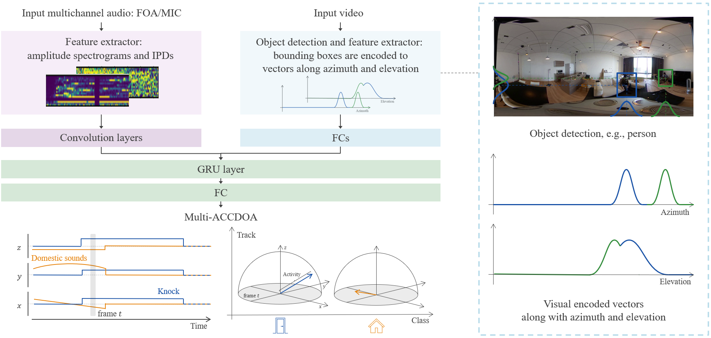

# DCASE2023 Sound Event Localization and Detection Track B Audio-Visual Inference
[Please visit the official webpage of the DCASE 2023 Challenge for details missing in this repository](https://dcase.community/challenge2023/task-sound-event-localization-and-detection-evaluated-in-real-spatial-sound-scenes).


## Baseline method
The baseline method for the audio-visual SELD task has similar architecture to an audio-only SELD method based on SELDnet [1] and multiple activity-coupled Cartesian direction of arrival (Multi-ACCDOA) [2].

Before the audio-visual SELD method, here is a summary of the audio-only SELD method.
The input is multichannel audio, from which the different acoustic features are extracted based on the input format of the audio.
The audio-only method takes a sequence of consecutive feature-frames and predicts all the active sound event classes for each of the input frame along with their respective spatial location, producing the temporal activity and DOA trajectory for each sound event class.
In particular, a convolutional recurrent neural network (CRNN) is used to map the frame sequence to a Multi-ACCDOA sequence output which encodes both sound event detection (SED) and direction of arrival (DOA) estimates in the continuous 3D space as a multi-output regression task.
The CNN part encodes the audio features to audio embeddings, and then the RNN and fully-connected layers (FCs) decode the embedding sequence to the Multi-ACCDOA sequence.
Each sound event class in the Multi-ACCDOA output is represented by three regressors that estimate the Cartesian coordinates x, y and z axes of the DOA around the microphone.
If the vector length represented by x, y and z coordinates are greater than a threshold, the sound event is considered to be active, and the corresponding x, y, and z values are considered as its predicted DOA.

While the audio-only method takes only the audio input, the baseline method for the audio-visual SELD task takes both the audio and a visual input.
The visual input is a corresponding image at the start frame of the audio feature sequence.
With the corresponding image, an object detection module (e.g., [3]) outputs bounding boxes of potential objects.
These bounding boxes are transformed to a concatenation of two Gaussian-like vectors, where they represent likelihoods of objects present along the image's horizontal axis and vertical axis [4].
The Gaussian-like vectors are encoded to a visual embedding by FCs.
Then the audio embeddings from the audio encoder and the visual embedding are concatenated.
The concatenated feature sequence are fed into the decoder to output a Multi-ACCDOA sequence.

The final audio-visual SELD baseline architecture is as shown below.
<p align="center">
   
</p>

## Datasets
* [**Sony-TAu Realistic Spatial Soundscapes 2023 (STARSS23)**](https://zenodo.org/record/7709052)

Similar to previous editions of the challenge, the participants can use either or both the audio format: **Ambisonic** and **Microphone Array**.
The dataset contain recordings from an identical scene, with **Ambisonic** version providing four-channel First-Order Ambisonic (FOA) recordings while **Microphone Array** version provides four-channel directional microphone recordings from a tetrahedral array configuration.
In addition to the audio data, this year the dataset also include **the corresponding videos** for **track B audio-visual inference**.

The datasets consist of a development and an evaluation set.
All participants are expected to use the fixed splits provided in the baseline method for reporting the development scores.
The evaluation set will be released at a later point.

More details on the recording procedure and dataset can be read on the [previous STARSS22 paper](https://dcase.community/documents/workshop2022/proceedings/DCASE2022Workshop_Politis_51.pdf).

The development dataset can be downloaded from the link - [**Sony-TAu Realistic Spatial Soundscapes 2023 (STARSS23)**](https://zenodo.org/record/7709052).


## Getting started
### Directory structure
We recommend you to follow the below directory structure.
`foa_dev`, `metadata_dev`, `mic_dev`, and `video_dev` are from the above link of zenodo.

```
audio-visual-seld-dcase2023         This repository.
├── data_dcase2023_task3
│   ├── foa_dev                     Ambisonic format, 24kHz, four channels.
│   ├── list_dataset                Lists for experimental shell scripts.
│   ├── metadata_dev                CSV format.
│   ├── mic_dev                     Microphone array format, 24kHz, four channels.
│   ├── model_monitor               Made from the below trial.
│   ├── video_360x180_dev           MP4 format, converted from video_dev by `resize_video.py`.
│   └── video_dev                   MP4 format.
├── dcase2022_task3_seld_metrics    We follow the metrics of previous challenge.
├── feature
├── mmdetection                     Made from the below installation.
├── net
├── script
└── util
```

### Prerequisites
The provided system has been tested on python 3.8.16 and pytorch 1.7.1.

You can install the requirements by running the following lines.
```
conda create --name audio_visual_seld_dcase2023 python=3.8
conda activate audio_visual_seld_dcase2023
conda install pytorch==1.7.1 torchvision==0.8.2 torchaudio==0.7.2 cudatoolkit=11.0 -c pytorch
```

You need to set up mmdetection for object detection model. (Ref: https://github.com/open-mmlab/mmdetection/blob/master/docs/en/get_started.md/)
```
pip install -U openmim
mim install mmcv-full
git clone https://github.com/open-mmlab/mmdetection.git
cd mmdetection
pip install -v -e .
mim download mmdet --config yolox_tiny_8x8_300e_coco --dest .
cd ..
```

After installation of mmdetection, you can continue to install with the below lines.
```
conda install tensorboard
conda install tqdm
conda install -c conda-forge pysoundfile
conda install -c conda-forge librosa
conda install ipython
conda install chardet
pip install moviepy==1.0.3
```

### Training trial
Before training, we need to convert HD mp4 files to low resolution mp4 files (360x180) for reduce of calculation cost.
```
python resize_video.py
```

After the conversion, run the script as shown below.
This will dump the logs and models in the `./data_dcase2023_task3/model_monitor/<DateTime>`.

You may modify the path for python on the script.
CPU memory needs 15GB and GPU memory 2GB.
The training takes around half a dozen hours.
```
bash script/train_seld_foa.sh
```

Microphone array version is the same way.
```
bash script/train_seld_mic.sh
```

You can check the training details using TensorBoard.

### Evaluation trial
Under construction.


## Results on development dataset
As the [SELD evaluation metric](https://www.aane.in/research/computational-audio-scene-analysis-casa/sound-event-localization-detection-and-tracking#h.ragsbsp7ujs), we employ the joint localization and detection metrics proposed in [5], with extensions from [6] to support multi-instance scoring of the same class.

There are in total four metrics that we employ in this challenge.
The first two metrics are more focused on the detection part, also referred as the location-aware detection, corresponding to the error rate (ER<sub>20°</sub>) and F-score (F<sub>20°</sub>) in one-second non-overlapping segments.
We consider the prediction to be correct if the prediction and reference class are the same, and the distance between them is below 20&deg;.
The next two metrics are more focused on the localization part, also referred as the class-aware localization, corresponding to the localization error (LE<sub>CD</sub>) in degrees, and a localization Recall (LR<sub>CD</sub>) in one-second non-overlapping segments, where the subscript refers to _classification-dependent_.
Unlike the location-aware detection, we do not use any distance threshold, but estimate the distance between the correct prediction and reference.

Following the previous challenge, this year we use the macro mode of computation.
We first compute the above four metrics for each of the sound class, and then average them to get the final system performance.

The evaluation metric scores for the test split of the development dataset are given below.

| Input | ER<sub>20°</sub> | F<sub>20°</sub> | LE<sub>CD</sub> | LR<sub>CD</sub> |
| ----| --- | --- | --- | --- |
| Ambisonic + Video                 | 1.07 | 14.3 % | 48.4&deg; | 35.5 % |
| Ambisonic (for comparison)        | 1.00 | 14.4 % | 60.4&deg; | 32.7 % |
| Microphone Array + Video          | 1.08 |  9.8 % | 62.4&deg; | 29.2 % |
| Microphone Array (for comparison) | 1.03 | 11.4 % | 77.3&deg; | 30.4 % |

**Note:** The reported baseline system performance is not exactly reproducible due to varying setups. However, you should be able to obtain similar results.


## Reference
If you are using this baseline method or the datasets in any format, then please consider citing the following papers.

1. [Sharath Adavanne, Archontis Politis, Joonas Nikunen and Tuomas Virtanen, "Sound event localization and detection of overlapping sources using convolutional recurrent neural network" in IEEE Journal of Selected Topics in Signal Processing (JSTSP 2018)](https://arxiv.org/pdf/1807.00129.pdf)

2. [Kazuki Shimada, Yuichiro Koyama, Shusuke Takahashi, Naoya Takahashi, Emiru Tsunoo, and Yuki Mitsufuji, " Multi-ACCDOA: localizing and detecting overlapping sounds from the same class with auxiliary duplicating permutation invariant training" in IEEE International Conference on Acoustics, Speech, & Signal Processing (ICASSP 2022)](https://arxiv.org/pdf/2110.07124.pdf)

3. [Zheng Ge, Songtao Liu, Feng Wang, Zeming Li, and Jian Sun, "YOLOX: Exceeding YOLO Series in 2021" in arXiv 2021](https://arxiv.org/pdf/2107.08430.pdf)

4. [Xinyuan Qian, Zhengdong Wang, Jiadong Wang, Guohui Guan, and Haizhou Li, "Audio-Visual Cross-Attention Network for Robotic Speaker Tracking" in IEEE/ACM Transactions on Audio, Speech, and Language Processing (TASLP 2023)](https://ieeexplore.ieee.org/document/9968308)

5. [Annamaria Mesaros, Sharath Adavanne, Archontis Politis, Toni Heittola, and Tuomas Virtanen, "Joint Measurement of Localization and Detection of Sound Events", in IEEE Workshop on Applications of Signal Processing to Audio and Acoustics (WASPAA 2019)](https://ieeexplore.ieee.org/document/8937220)

6. [Archontis Politis, Annamaria Mesaros, Sharath Adavanne, Toni Heittola, and Tuomas Virtanen, "Overview and Evaluation of Sound Event Localization and Detection in DCASE 2019", IEEE/ACM Transactions on Audio, Speech, and Language Processing (TASLP 2020)](https://arxiv.org/pdf/2009.02792.pdf)

We use the following open source repositories.

7. `mmdetection/` is an object detection module from https://github.com/open-mmlab/mmdetection.

8. `dcase2022_task3_seld_metrics/*.py` and parts of `README.md` are also based on https://github.com/sharathadavanne/seld-dcase2022.

9. `net/net_util.py` is a modified version of https://github.com/yinkalario/Two-Stage-Polyphonic-Sound-Event-Detection-and-Localization/blob/master/models/model_utilities.py.


## License
This repository is under the MIT License.
